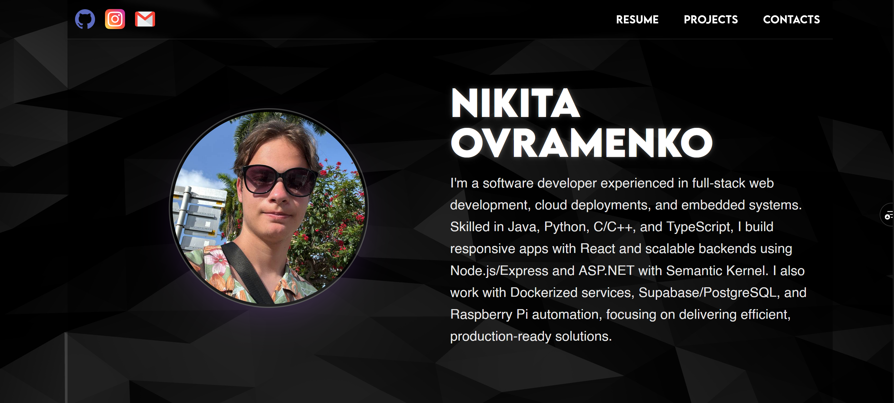

<div align="center">

# 🚀 Nikita Ovramenko — Portfolio

[](https://portfolio1-theta-rouge.vercel.app/)
[](https://react.dev/)
[](https://www.typescriptlang.org/)
[](https://tailwindcss.com/)

**A dynamic, interactive portfolio showcasing software development projects with real-time GitHub integration and physics-based UI.**

[Features](#-features) • [Tech Stack](#️-tech-stack) • [Getting Started](#-getting-started) • [Architecture](#-architecture) • [Contact](#-contact)

</div>

---

## ✨ Features

### 1. Dynamic GitHub README Rendering

Each project page fetches and renders the README directly from GitHub, providing always up-to-date documentation.

**How it works:**

```
User clicks project → Fetch README via GitHub API → Base64 decode → Render with ReactMarkdown
```

**Key capabilities:**

- **GitHub API Integration** — Fetches README content using the GitHub REST API with token authentication
- **Base64 Decoding** — Converts the API response to UTF-8 text
- **Mermaid Diagram Support** — Detects `language-mermaid` code blocks and renders them as diagrams
- **Relative Image Resolution** — Automatically converts relative image paths to raw GitHub URLs

```typescript
// Relative images in READMEs are resolved to raw.githubusercontent.com
const resolvedSrc =
  src && !src.startsWith("http")
    ? `https://raw.githubusercontent.com/NikitaaOvramenko/${slug}/main/${src}`
    : src;
```

### 2. Google Sheets CMS Integration

Project data is managed through a Google Spreadsheet, enabling dynamic content updates without code changes.

**Workflow:**

```
Google Spreadsheet → Sheets API → JSON Conversion → Project Cards → Navigation
```

**Benefits:**

- **No-Code Updates** — Add/remove projects by editing the spreadsheet
- **Structured Data** — Headers become object keys, rows become project entries
- **Dynamic Navigation** — Each project card links to `/project/:repo_name` for README rendering

```typescript
// Convert Google Sheets 2D array to JSON objects
function sheetsToJson(sheetsData: string[][]): SheetProject[] {
  const headers = sheetsData[0];
  const rows = sheetsData.slice(1);
  return rows.map((row) => {
    const obj: SheetProject = {};
    headers.forEach((header, index) => {
      obj[header] = row[index] || "";
    });
    return obj;
  });
}
```

### 3. Engaging UI/UX

#### Vanta.js Animated Background

Interactive 3D waves powered by Three.js that respond to mouse movement, creating an immersive dark theme atmosphere.

#### Matter.js Physics Engine

The Skills section features floating, draggable skill badges in a zero-gravity simulation:

- Badges bounce off walls
- Users can grab and throw them
- Responsive sizing based on viewport

#### Dark Neon Theme

- **Colors:** Black background with purple/cyan gradient accents
- **Typography:** Custom Lemon Milk font family
- **Effects:** Glassmorphism cards, neon text shadows, smooth transitions

#### Responsive Design

- Mobile-first approach with Tailwind breakpoints
- Animated hamburger menu for mobile navigation
- Smooth scroll navigation between sections

---

## 🛠️ Tech Stack

| Category          | Technologies                              |
| ----------------- | ----------------------------------------- |
| **Framework**     | React 18.3, TypeScript 5.6                |
| **Build Tool**    | Vite 6.0                                  |
| **Styling**       | Tailwind CSS 3.4, Custom CSS              |
| **Markdown**      | react-markdown, remark-gfm, rehype-raw    |
| **Diagrams**      | @lightenna/react-mermaid-diagram, Mermaid |
| **Physics**       | Matter.js                                 |
| **3D Effects**    | Vanta.js, Three.js                        |
| **HTTP**          | Axios                                     |
| **Routing**       | React Router DOM 7                        |
| **Analytics**     | react-ga4 (Google Analytics 4)            |
| **UI Components** | SweetAlert2, react-icons                  |

---

## 📁 Project Structure

```
src/
├── components/          # Reusable UI components
│   ├── Background.tsx   # Vanta.js waves wrapper
│   ├── NavBar.tsx       # Responsive navigation
│   ├── Footer.tsx       # Site footer
│   └── ...
├── pages/               # Route pages
│   ├── HomePage.tsx     # Main landing page
│   └── ProjectPage.tsx  # Dynamic README renderer
├── home-page/           # Home page sections
│   ├── About.tsx        # Bio section
│   ├── Experiences.tsx  # Work experience
│   ├── Skills.tsx       # Skills display
│   ├── SkillsPhysics.tsx# Matter.js physics simulation
│   ├── Projects.tsx     # Google Sheets project grid
│   └── Contacts.tsx     # Contact form & map
├── data/                # Static data & templates
│   ├── projectsData.tsx # Legacy project data
│   ├── experienceData.tsx
│   └── ballz.tsx        # Physics ball configurations
├── icons/               # Social media icons
├── sprites/             # Technology logo sprites
├── projectPics/         # Project screenshots
└── pdfs/                # Downloadable resume
```

---

## 🚀 Getting Started

### Prerequisites

- Node.js 18+
- npm or yarn

### Installation

1. **Clone the repository**

   ```bash
   git clone https://github.com/NikitaaOvramenko/Portfolio1.git
   cd Portfolio1
   ```

2. **Install dependencies**

   ```bash
   npm install
   ```

3. **Set up environment variables**

   Create a `.env` file in the root directory:

   ```env
   VITE_GITHUB_TOKEN=your_github_personal_access_token
   VITE_SPREADSHEET_API=your_google_sheets_api_key
   ```

4. **Start the development server**

   ```bash
   npm run dev
   ```

5. **Open in browser**
   ```
   http://localhost:5173
   ```

### Build for Production

```bash
npm run build
npm run preview
```

---

## 🏗️ Architecture

### Data Flow

```
┌─────────────────┐     ┌──────────────────┐     ┌─────────────────┐
│  Google Sheets  │────▶│   Sheets API     │────▶│  Projects.tsx   │
│  (Project Data) │     │                  │     │  (Project Grid) │
└─────────────────┘     └──────────────────┘     └────────┬────────┘
                                                          │
                                                          ▼
┌─────────────────┐     ┌──────────────────┐     ┌─────────────────┐
│  GitHub Repos   │────▶│   GitHub API     │────▶│ ProjectPage.tsx │
│  (README.md)    │     │  (Fetch README)  │     │ (Render README) │
└─────────────────┘     └──────────────────┘     └─────────────────┘
```

### Key Components

| Component           | Responsibility                                      |
| ------------------- | --------------------------------------------------- |
| `Background.tsx`    | Wraps content with Vanta.js animated waves          |
| `SkillsPhysics.tsx` | Matter.js physics simulation for skill badges       |
| `Projects.tsx`      | Fetches from Google Sheets, renders project cards   |
| `ProjectPage.tsx`   | Fetches GitHub README, renders with Mermaid support |

---

## 🔧 Environment Variables

| Variable               | Description                                   |
| ---------------------- | --------------------------------------------- |
| `VITE_GITHUB_TOKEN`    | GitHub Personal Access Token for API requests |
| `VITE_SPREADSHEET_API` | Google Sheets API key for project data        |

---

## 📸 Screenshots

| Home Page                                                  | Project Page             |
| ---------------------------------------------------------- | ------------------------ |
|  | Dynamic README rendering |
| Physics-based skills section                               | Mermaid diagram support  |

---

## 📫 Contact

**Nikita Ovramenko**

- 🌐 [Portfolio](https://nikitaaovramenko.github.io/Portfolio1/)
- 💼 [LinkedIn](https://www.linkedin.com/in/nikita-ovramenko-9042b8251)
- 🐙 [GitHub](https://github.com/NikitaaOvramenko)
- 📧 [nikita.ovramenko@torontomu.ca](mailto:nikita.ovramenko@torontomu.ca)

---

<div align="center">

**Built with ❤️ using React, TypeScript, and Tailwind CSS**

</div>
